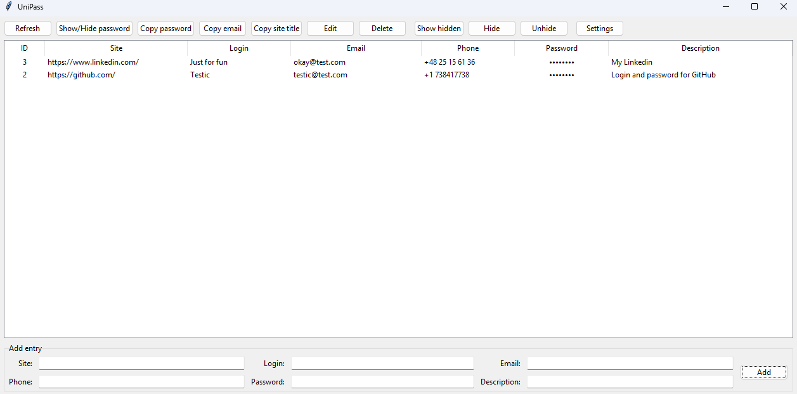

# Python-Unipas-cross-platform-password-manager
Universal cross-platform password manager with a 6-digit PIN, encrypted storage, and a simple GUI.

**UniPass** is a simple cross‑platform password manager with AES‑GCM encryption and a 6‑digit PIN code.  
This fork is configured to always store the database file (`unipass.db`) **in the same folder as the program**.




## Features

- 6‑digit PIN unlock
- AES‑256 GCM encryption (key derived with scrypt)
- Encrypted SQLite database (no plaintext fields)
- Tkinter GUI with table view and add/edit/delete forms
- Fields: Site, Login, Email, Phone, Password, Description
- Buttons: Add, Edit, Show/Hide password, Copy password, Copy email, Copy site name, Delete, Refresh
- Database always saved as `unipass.db` in the program folder

## How to Build (Windows)

1. **Install dependencies**:

```bash
py -m venv .venv
.venv\Scripts\pip install --upgrade pip
.venv\Scripts\pip install cryptography pyinstaller
```

2. **Build executable**:

```bash
.venv\Scripts\pyinstaller -F -w app.py -n UniPass --icon=icon.ico
```

- `-F` → single exe file  
- `-w` → no console window  
- `--icon=icon.ico` → optional custom icon

3. **Result**: the built file will be located in `dist/UniPass.exe`.

4. **Usage**: copy `UniPass.exe` to your USB stick.  
   On first run it will create `unipass.db` in the same folder.